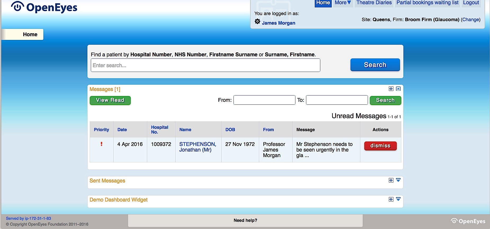
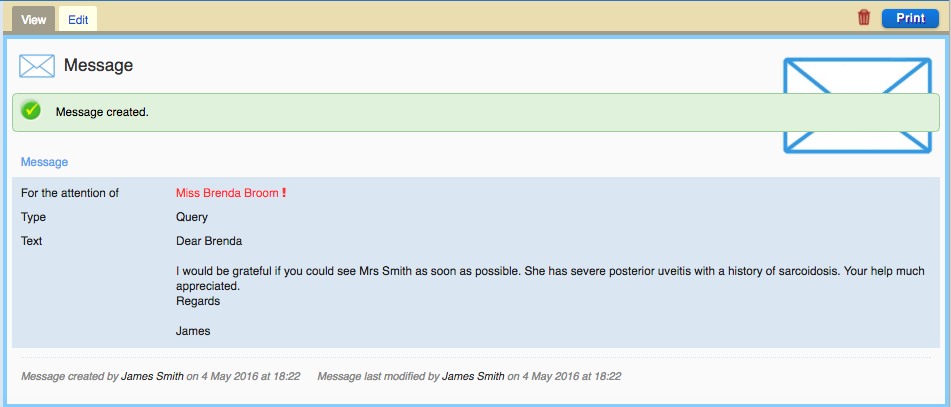
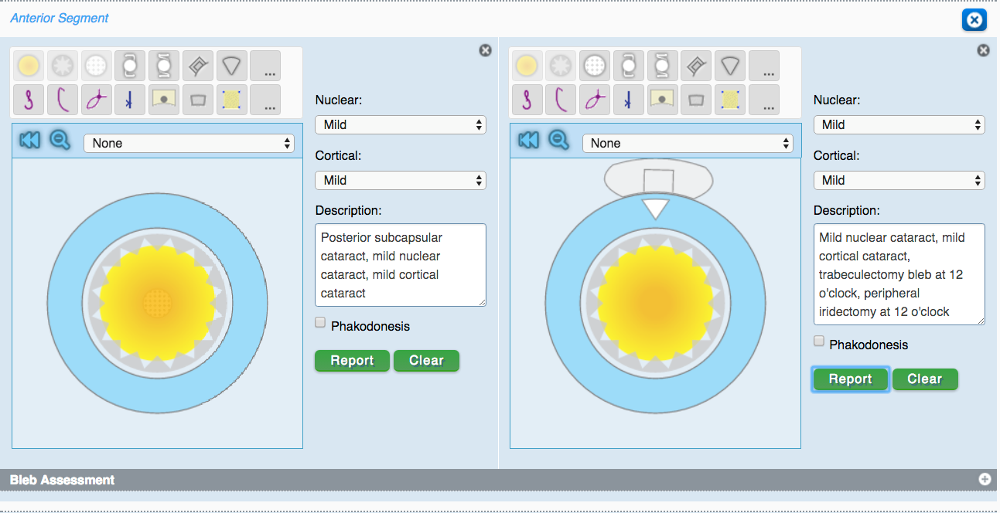
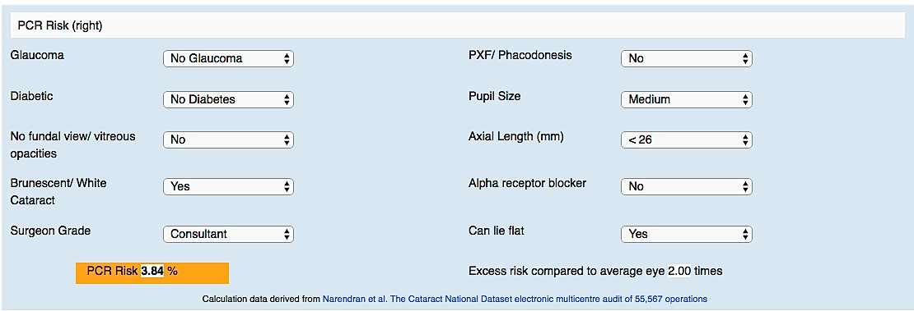
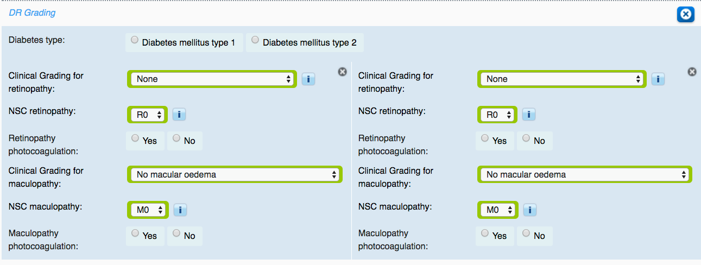
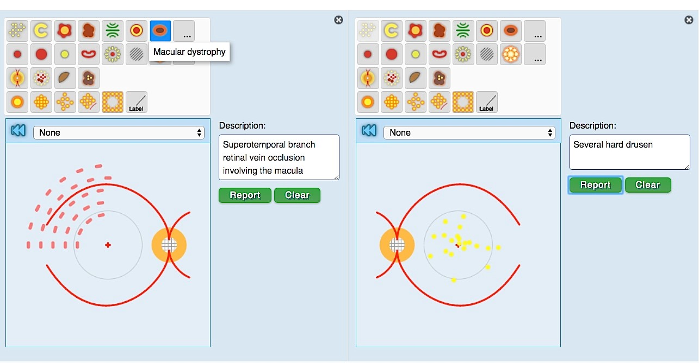
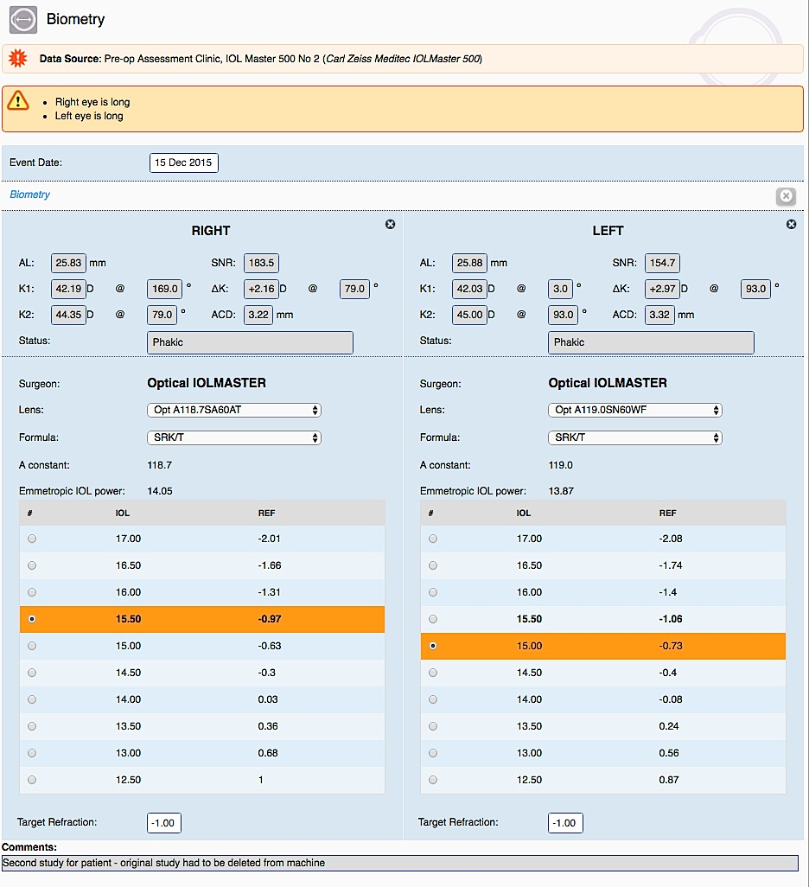
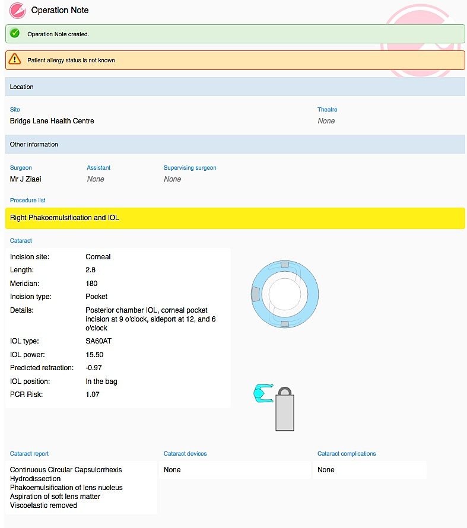
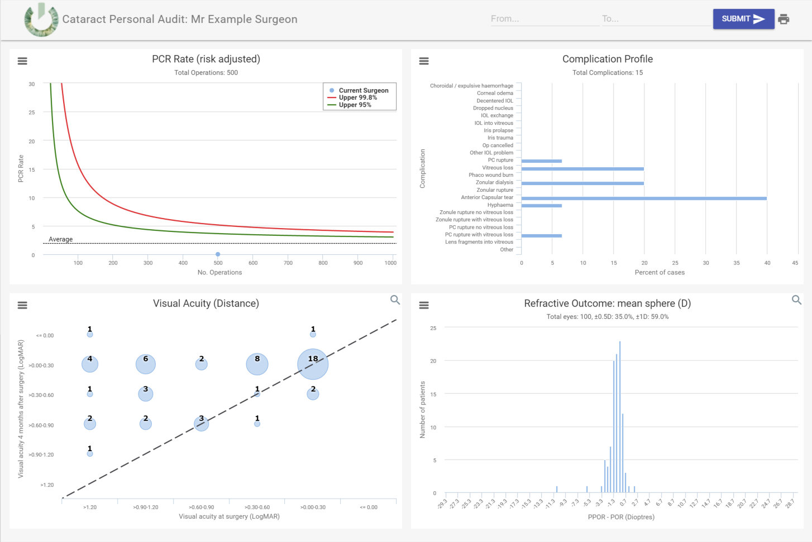

<section>
      

      

                      <h2 class="mb-4">OpenEyes in more Detail</h2>
       
 

 

When you start OpenEyes you will see a dashboard view of your clinic. Using configurable widgets you will be able to see patients in your clinic work list and track their progress in the clinic. The dashboard also shows the messaging feature whereby patient records can be tagged with notes advising on clinical state or future actions. These messages are embedded in the patient record and support clinicians to clinician communication to ensure that patients requiring urgent attention can be flagged.

 

  

 
The messaging application allows point to point communication with a priority setting to ensure that no patient is lost.

 

  

 
<strong>Eyedraw: the fastest way to enter clinical information</strong>
 The Eyedraw tools are a key feature of OpenEyes. An example of the anterior segment tool is shown below which allows the recording of cataract state. These descriptions are stored as SNOMED coded items which can be searched in the OE database.

 

  

 
The data collected with these tools can be used to support risk assessment – for example to populate data for the PCR risk calculator.

 

  

 
Or the assessment of diabetic retinopathy grading

 

  

 
The clinical assessment of the posterior pole can also be assessed graphically, for example for a patient with a branch retinal vein occlusion.

 

  

 
Correspondence can also be automated and generated within OpenEyes to summarise diagnosis and treatment.
 
 
<strong>Device Integration</strong>
 
OpenEyes supports device connectivity via DICOM. For example, OpenEyes can pull the data from IOLmasters and other biometry devices into the application for display at the time of surgery. The same technology can be used to display visual field, OCT data or fundus images.

 

  

 
The lens selection is then available automatically in the cataract operation note.

 

  

 
<strong>Data and Audit</strong>
 
OpenEyes is fully compliant with the Royal College of Ophthalmologist's national cataract audit dataset and can return data for group or individual analysis. OpenEyes provide a rich set of tools so that you can view your personal audit data in real time. The data analytics package for cataract provides a risk adjust plot of PCR outcome that can be exported for appraisal purposes.

 

  

</section>
